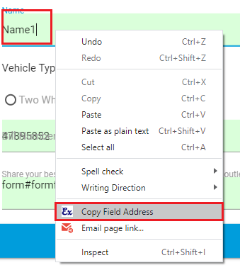
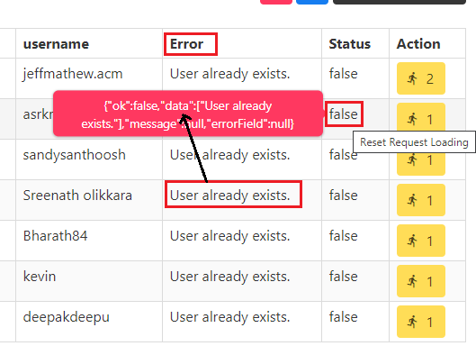

## Changelog

### V.0.2.6

* NEW: Active Realtime Manually Saved Active Entry Checkbox.
* NEW: Create `/src/boot/` for development and production mode settings.
* Fixed: Denying load of `script/custom_form_functions.js`.

### V.0.2.5

* NEW: `element_exists` : Form will start feeding when this element is visible.
  - 
* NEW: Add `hostname` URL Type in Form URL and Success Page URL
* NEW: Global Variable using in Excel Column Custom JS Script Option.

### V.0.2.4

* NEW: Manually Feed Field Data According to You, Put You JS Code in the `form_filled` key.
* NEW: Click on the excel column name then copied column key name in the clipboard.
```js
// Fill Field
FillAPP.CFD.fillColumnData("00000_field_1")
FillAPP.CFD.fillColumnData("00001_monthinput", { 
  event: ["click", "change"] 
})
FillAPP.CFD.fillColumnData("00002_yearinput")
```
* Library: `https://github.com/zenorocha/clipboard.js#readme`
* Storage Excel Columns Fields Data in the Local Storage. `fillDataV1__excelColumn`
* Improve: Generate excel sheet for feeding in the site.

### V.0.2.3

* `NEW: ` If excel entry is uploaded then download uploaded and uncompleted entry in the excel sheet.

### V.0.2.2

* Add new key `background_response` = If Request Run is being done in Background After this, if a success message is received.
* If manually check saved checkbox run this js in the console
  ```js
  FillRoot.manuallySavedActiveEntry()
  ```

### V.0.2.1

* `FIXED:` If select box options length is 0 then showing error.
  * `src/background.js:203`

### V.0.2.0

* `FIXED:` src/script/root.js:14~15

### V.0.1.9

* `NEW: ` Clear field value then fill new value.
* `FIXED:` Not working in the Angular Site.
* `FIXED:` Custom keys `page_loaded` and `fill_action` running time.
* `FIXED:` Check Success Message.

### V.0.1.8

* `NEW: ` Change Field Background color of fill data completed in the form field.
  - 
* `FIXED:` if name attribute not found in the form field then also generate excel sheet.
* `FIXED:` Field name in the Extension Popup Page
* `FIXED:` If form submit then redirect not working.

### V.0.1.7

* Typewriter Effect and Set Typewriter Speed while filling data in the field
  - 
* Start/Pause Application With `Alt+Q`
* `FIXED:` Column Settings Model Not Open

### V.0.1.6

* `NEW:` After filling the data of field, filling the data of another field.
 - 
* `IMPROVE:` Automatic Generate Excel Sheet according to form fields
* `FIXED:` Date Format in Uppercase

### V.0.1.5

* `NEW:` To change the Date Format of a column in Excel so that you can change the Date Format according to the Form.
* Date Formats:
  | Excel Column Date | Convert to this Format | Output |
  | ----------------- | ---------------------- | --------------------- |
  | 05-11-2020 | `DD` | 05 |
  | 05-11-2020 | `MM` | 11 |
  | 05-11-2020 | `YY` | 20 |
  | 05-11-2020 | `YYYY` | 2020 |
  | 05-11-2020 | `MM-DD-YYYY` | 11-05-2020 |
  | 05-11-2020 | `MM/DD/YYYY` | 11/05/2020 |
* All Date Format: https://momentjs.com/docs/#/displaying/format/

### V.0.1.4

* `NEW: ` Application Settings
 - 
* `NEW: ` Option to turn on and off the Toolbar feature and second option to reposition it to the top or bottom of the screen.
* `NEW: ` Check Get Parameters in the Options Page URL `"?tab=1&update=0"`

### V.0.1.3

* `FIXED: ` Background Javascript Error

### V.0.1.2

* Video Tutorial: https://youtu.be/YQjNpHHdYvo
* `NEW: ` Support Page: https://ctechhindi.blogspot.com/2020/10/support-page-fill-excel-data-cth-google.html
* `NEW: ` Show Total Entry and Active Entry Number in the Toolbar
* `NEW: ` If are you using generate excel method then field address and field settings (field type) data automatic set.
* `FIXED: ` Some excel sheet columns data not fetch in the extension options page.
* `IMPROVE: ` Extension Context Menu Option
  * 

### V.0.1.1

* `NEW: ` Trigger Javascript Event in the Form Field
  * "click",
  * "dblclick",
  * "change",
  * "copy",
  * "cut",
  * "paste",
  * "submit",
  * "focus",
  * "focusin",
  * "focusout",
  * "mousedown",
  * "mouseenter",
  * "mouseleave",
  * "mousemove",
  * "mouseup",
  * "mouseover",
  * "mouseout",
  * "input",
  * "keydown",
  * "keypress",
  * "keyup",
  * "load",
  * "unload"
* `FIXED: ` If insert second form url and then delete second form url then showing error
* `NEW: ` Add Option in the Chrome `Right Option Menu`, Copy Field Address
  * 

### V.0.1.0

* `INSERT: ` About Us Tab

### V.0.0.9

* `BIG CHANGE: ` Insert Multiple Action Site
* `FIXED: ` Success Message not working in the different domain
* About Video: https://youtu.be/IV6yMHf2rNo

### V.0.0.8

* Full Page Loading in the `Request Send Page`.
* Add Request Settings Tab in the `Request Send Page`.
* Count Total Successfully Saved Entry Data in the `Request Send Page`.
* Hide Request Error Message if run bulk entry in the `Request Send Page`.
* Show and Hide Request Error Response Data in the `Request Send Page`.
* Show request error if mouseover request status table row in the `Request Send Page`. 
  * 

### V.0.0.7

* Add new key `page_loaded` = After the page is fully loaded, you can give your Custom Script.
* Add new key `fill_action` = If you do not want Automatic Form Feed or your form opens after any request, then you can place Javascript event in any HTML Element in the page.
  * अगर आप Automatic Form Feed नहीं करवाना चाहते या फिर आपका Form किसी Request के बाद Open होता है तो आप Page में किसी भी HTML Element में Javascript event लगा सकते है तो जैसे वह Event Call होगा Form Feed हो जायेगा।
  * Select HTML Element and Run Javascript Event on selected html element
  * Event Types: "click", "dblclick", "change", "copy", "cut", "paste", "submit", "focus", "focusin", "focusout", "mousedown", "mouseenter", "mouseleave", "mousemove", "mouseup", "mouseover", "mouseout", "input", "keydown", "keypress", "keyup", "load", "unload", "force"
  ```js
  // With this, when you click on this HTML Element, only your Form Feed will start.
  document.querySelector("#htmlElm").addEventListener("click", FillAPP.checkNextEntry);
  ```
* Send all the requests at once in the `Request Send Page`.
* Stop/Reset `Request Status` in the `Request Send Page`.
* Add New Library `npm install --save xlsx`
* Export Request Excel Data in the Excel Sheet.

### V.0.0.6

* FOR this site `https://trade.algofox.in`

### V.0.0.5

* Fixed Success URL not Match.
* Add new key `form_filled` = After the form is successful feeded, you can give what script you want to run.

### V.0.0.4

* Fix Spelling Mistake
* Fix copy element selector 
* Using new library

### V.0.0.3

* Fix Bug: auto save entry

### V.0.0.2

* After the form is successful submit, you can give what script you want to run in this custom key `form_submit`.
* Run those `keys` which are not in the excel sheet
* Fix Spelling Mistake
* Add Action URL Type `{fullPath, pathName}`
* Update Auto Catch Element Identity
* Add Demo Site and Excel Sheet Data
* https://phppot.com/demo/php-user-registration-form/

### V.0.0.1 `(Beta)`

* Form Data Request Sent on Server
* Fill Automatic HTML Form
* Use Custom JS Script in HTML Field's
