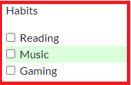
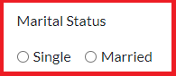
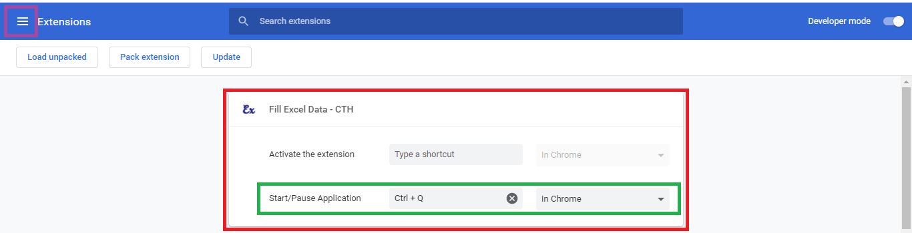

# Documentation

## HTML Form Field Types

<!-- ### `Drop-down (Select Box)` -->

<!-- --- -->

### `Checkbox`



#### ***Types of Methods for Select Checkbox in the HTML Form***

1. Create separate columns for all checkboxes in Excel sheet. like this

    | Reading | Music | Gaming |
    | ------- | ----- | ------ |
    | TRUE `(Select Checkboxes)` | TRUE `(Select Checkboxes)` | TRUE `(Select Checkboxes)` | 
    | Empty `(Not Select Checkboxes)` | Empty `(Not Select Checkboxes)` | Empty `(Not Select Checkboxes)` | 

    * And Select `Single Element` for everyone columns
    * You can give anything in these Excel Column, but if you give Empty then option will not be selected.
    * If the name of a column does not appear in `Site Columns` then you can insert it manually.

    &nbsp;&nbsp;

2. Create only one column for all checkboxes in Excel sheet, like this. 

    | Habits |
    | ------- |
    | Reading, Gaming `(Select Reading and Gaming Checkbox)` |
    | Music, Reading `(Select Music and Reading Checkbox)` |
    | Gaming `(Select Only Gaming Checkbox)` |
    | Empty `(Not Select)` | 

    * But HTML Form Element Selection Types:
        * `Multiple Element (Comma separated)` for this single column

    &nbsp;&nbsp;

#### ***Also one ways to select the checkbox***

1. Through the value of the checkbox `(What we don't see is in the Source Code of the page.)`

#### ***If your Excel data is not equal to the value of the checkbox then you can use RegExp.***

| Habits |
| ------- |
| ding `(Select Reading Checkbox)` |
| ic `(Select Music Checkbox)` |
| Gami `(Select Gaming Checkbox)` |
| Empty `(Not Select)` | 

&nbsp;&nbsp;

### `Radio`



#### ***Create only one column for all checkboxes in Excel sheet, like this.***

| Married |
| ------- |
| Single `(Select Single)` |
| Married `(Select Married)` |
| Empty `(Not Select)` | 

* First Check `name` attribute in the radio element.
    * if found `name` attribute. `(Single Element Working Wall.)`
    * if not found `name` attribute. `(So Select Multiple Element (Comma separated))`, like this:
        * div:nth-child(1) > input,div:nth-child(2) > input

#### ***Also one ways to select the radio***

1. Through the value of the radio `(What we don't see is in the Source Code of the page.)`

#### ***If your Excel data is not equal to the value of the radio then you can use RegExp.***

| Married |
| ------- |
| Sin `(Select Single)` |
| ried `(Select Married)` |


&nbsp;&nbsp;


&nbsp;&nbsp;&nbsp;&nbsp;

## Predefined Custom Keys

* `page_loaded` : After the page is fully loaded, you can give your Custom Script.
* `fill_action` : If you do not want Automatic Form Feed or your form opens after any request, then you can place Javascript event in any HTML Element in the page.
* `form_filled` : After the form is successful feeded, you can give what script you want to run.
* `entry_saved` : After the form is successfully saved, you can give what script you want to run.
* `background_response`: If Request Run is being done in Background After this, if a success message is received.
* `element_exists`: Form will start feeding when this element is visible.
  - 
* `status`
* `isLoading`
* `totalErrorRequest`

&nbsp;&nbsp;&nbsp;&nbsp;

## Global Variable using in Excel Column Custom JS Script Option

Global Variable.

```js
// All Active Excel Entry Data
console.log(FillAPP.sData);
```

&nbsp;&nbsp;&nbsp;&nbsp;

## Insert Custom Javascript For Fill Form Data

Manually Feed Field Data According to You, Put You `JS Code` in the `form_filled` key, If click on the excel column name then copied column `key name` in the clipboard.

```js
// Fill Field
FillAPP.CFD.fillColumnData("00000_field_1")
FillAPP.CFD.fillColumnData("00001_field_2", { 
  event: ["click", "change"] 
})
FillAPP.CFD.fillColumnData("00002_field_3")
```

&nbsp;&nbsp;&nbsp;&nbsp;

## Set Custom Key in the Chrome Extension Page


