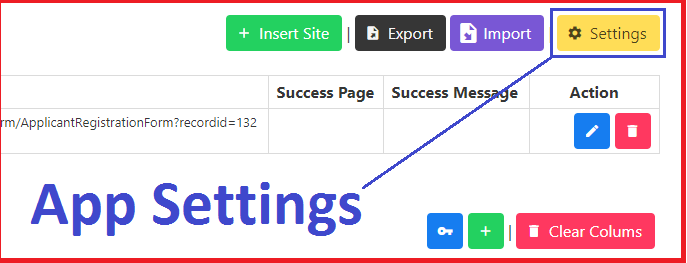
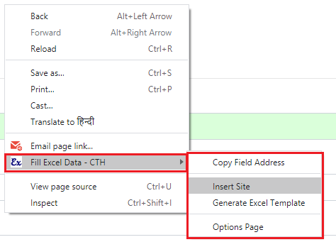
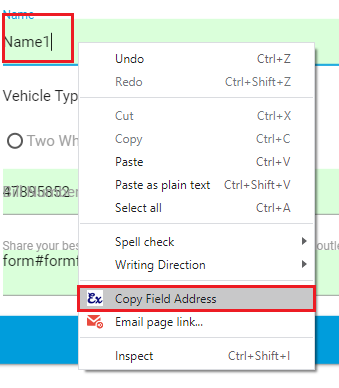
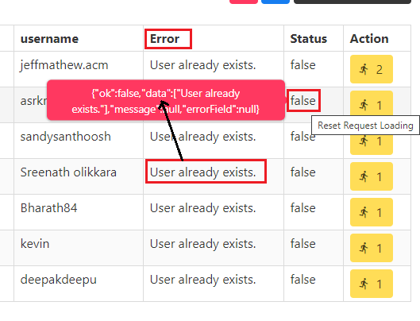

# Fill Excel Sheet Data into HTML Online Forms

Fill data in HTML form with Excel sheet from Chrome Extension.


## ✨ Features

* Fill Automatic Excel Sheet Data in the HTML Form
* Send Request for Insert Entry
* and more..

## 📦 [Install Extension](https://chrome.google.com/webstore/detail/fill-excel-data/hbdlidnbnmkmbeompcakgedghogdbbkf)

## 🎬 [Video Tutorial](https://youtu.be/IV6yMHf2rNo)

## [Documentation](Documentation.md)

## Screenshot

.png)

.png)

.png)

.png)

.png)

.png)


## 🚀 Debugging

Only for computer insect.

```bash
npm run build:dev
npm run watch
npm run watch:dev
npm run build-zip
```

## Tips Before Build

- Comment all log messages
- Delete Temp Folder

```
<!-- Delete dist folder then run this commands -->
npm run build
npm run build-zip
```

## Using Libraries

* [vue-codemirror](https://github.com/surmon-china/vue-codemirror)
* [SelectorGenerator](https://github.com/flamencist/SelectorGenerator)

## Keys Custom JS Script [Request Page]

```js
var currentFillData = this.data;
```

## Extension Page

```
chrome-extension://celcfdcmlebphlhcadpiepjliabdobhj/options/options.html
chrome-extension://celcfdcmlebphlhcadpiepjliabdobhj/request/request.html
```

## Custom Class

1. `CreateRequest.js`

```js
try {

    var req = new CreateRequest({
      "url": String,
      "field": {
        G_bene_gender: {
          defaultValue: ""
          field: "G_bene_gender"
          isFieldRequired: true
          is_runJScript: false
          jscript: ""
          key: "guar_gender"
        },
        ...
      },
      "data": {
        ben_dob: "2015-07-12"
        ben_gender: "Male"
        status: (...),
        ...
      },
      "successMsg": String,
      "successStatusCode": Number,
    });

    // Sent Request
    req.sentRequest()

} catch (e) {
    console.error(e)
}
```


## 🚫 Errors

* https://stackoverflow.com/questions/21177387/caution-provisional-headers-are-shown-in-chrome-debugger

## Browser Support

- `Chrome (Latest)`

## Changelog

### `Processing`

* Fill Form data with trigger event
* IF Request Not Send to Server Response
  ```
  {"readyState":0,"responseText":"","status":0,"statusText":"error"}
  ```
* Key not link to the submit button `https://ioclmaruticampaign.in/?ROiD=133953`
* If excel data successful fill in the form then play sound like
* Automatic set multiple select field type
* Radio Field Selector only name not id

### V.0.1.4

* `NEW: ` Application Settings
  * 
* `NEW: ` Option to turn on and off the Toolbar feature and second option to reposition it to the top or bottom of the screen.
* `NEW: ` Check Get Parameters in the Options Page URL `"?tab=1&update=0"`

### V.0.1.3

* `FIXED: ` Background Javascript Error

### V.0.1.2

* Video Tutorial: https://youtu.be/YQjNpHHdYvo
* `NEW: ` Support Page: https://ctechhindi.blogspot.com/2020/10/support-page-fill-excel-data-cth-google.html
* `NEW: ` Show Total Entry and Active Entry Number in the Toolbar
* `NEW: ` If are you using generate excel method then field address and field settings (field type) data automatic set.
* `FIXED: ` Some excel sheet columns data not fetch in the extension options page.
* `IMPROVE: ` Extension Context Menu Option
  * 

### V.0.1.1

* `NEW: ` Trigger Javascript Event in the Form Field
  * "click",
  * "dblclick",
  * "change",
  * "copy",
  * "cut",
  * "paste",
  * "submit",
  * "focus",
  * "focusin",
  * "focusout",
  * "mousedown",
  * "mouseenter",
  * "mouseleave",
  * "mousemove",
  * "mouseup",
  * "mouseover",
  * "mouseout",
  * "input",
  * "keydown",
  * "keypress",
  * "keyup",
  * "load",
  * "unload"
* `FIXED: ` If insert second form url and then delete second form url then showing error
* `NEW: ` Add Option in the Chrome `Right Option Menu`, Copy Field Address
  * 

### V.0.1.0

* `INSERT: ` About Us Tab

### V.0.0.9

* `BIG CHANGE: ` Insert Multiple Action Site
* `FIXED: ` Success Message not working in the different domain
* About Video: https://youtu.be/IV6yMHf2rNo

### V.0.0.8

* Full Page Loading in the `Request Send Page`.
* Add Request Settings Tab in the `Request Send Page`.
* Count Total Successfully Saved Entry Data in the `Request Send Page`.
* Hide Request Error Message if run bulk entry in the `Request Send Page`.
* Show and Hide Request Error Response Data in the `Request Send Page`.
* Show request error if mouseover request status table row in the `Request Send Page`. 
  * 

### V.0.0.7

* Add new key `page_loaded` = After the page is fully loaded, you can give your Custom Script.
* Add new key `fill_action` = If you do not want Automatic Form Feed or your form opens after any request, then you can place Javascript event in any HTML Element in the page.
  * अगर आप Automatic Form Feed नहीं करवाना चाहते या फिर आपका Form किसी Request के बाद Open होता है तो आप Page में किसी भी HTML Element में Javascript event लगा सकते है तो जैसे वह Event Call होगा Form Feed हो जायेगा।
  * Select HTML Element and Run Javascript Event on selected html element
  * Event Types: "click", "dblclick", "change", "copy", "cut", "paste", "submit", "focus", "focusin", "focusout", "mousedown", "mouseenter", "mouseleave", "mousemove", "mouseup", "mouseover", "mouseout", "input", "keydown", "keypress", "keyup", "load", "unload", "force"
  ```js
  // With this, when you click on this HTML Element, only your Form Feed will start.
  document.querySelector("#htmlElm").addEventListener("click", FillAPP.checkNextEntry);
  ```
* Send all the requests at once in the `Request Send Page`.
* Stop/Reset `Request Status` in the `Request Send Page`.
* Add New Library `npm install --save xlsx`
* Export Request Excel Data in the Excel Sheet.

### V.0.0.6

* FOR this site `https://trade.algofox.in`

### V.0.0.5

* Fixed Success URL not Match.
* Add new key `form_filled` = After the form is successful feeded, you can give what script you want to run.

### V.0.0.4

* Fix Spelling Mistake
* Fix copy element selector 
* Using new library

### V.0.0.3

* Fix Bug: auto save entry

### V.0.0.2

* After the form is successful submit, you can give what script you want to run in this custom key `form_submit`.
* Run those `keys` which are not in the excel sheet
* Fix Spelling Mistake
* Add Action URL Type `{fullPath, pathName}`
* Update Auto Catch Element Identity
* Add Demo Site and Excel Sheet Data
* https://phppot.com/demo/php-user-registration-form/

### V.0.0.1 `(Beta)`

* Form Data Request Sent on Server
* Fill Automatic HTML Form
* Use Custom JS Script in HTML Field's

## Reporting Issues radioactive

If you have a problem with this plugin or found any bug, please open an issue on GitHub.

## 📝 Copyright and License copyright

Code copyright 2020 ctechhindi. Code released under the MIT license.