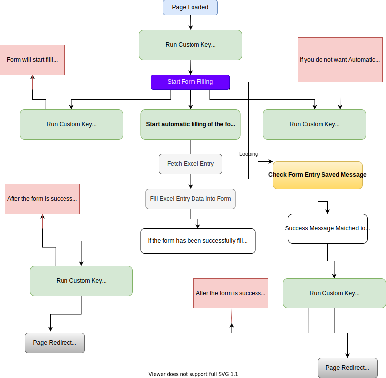

# Fill Excel Sheet Data into HTML Online Forms

Fill data in HTML form with Excel sheet from Chrome Extension.


## ✨ Features

* Fill Automatic Excel Sheet Data in the Online Form
* Automatic Generate Excel Sheet according to form fields
* Send Request (GET/POST/..) for Insert Entry
* Select the fields that depend on another field.
* Change the format of any date and fill it in the form.
* Run javascript event any field.
* Automatic click form submit button
* Insert custom javascript in the form fields
* Provide Toolbar
* Extension Context Menu Option.
* Hide JS Alert Message. 
* and more..

## Flowchart



## 📦 [Install Extension](https://chrome.google.com/webstore/detail/fill-excel-data/hbdlidnbnmkmbeompcakgedghogdbbkf)

## 🎬 [Video Tutorial](https://www.youtube.com/playlist?list=PLmrTMUhqzS3hCXSMbmgmh71-h-kwYAQ3t)

## [Documentation](Documentation.md)

## Screenshot

.png)

.png)

.png)

.png)

.png)

.png)


## Using Libraries

* [vue-codemirror](https://github.com/surmon-china/vue-codemirror)
* [SelectorGenerator](https://github.com/flamencist/SelectorGenerator)

## Browser Support

- `Chrome (Latest)`

## Changelog

### `Processing`

* Fill Form data with trigger event
* IF Request Not Send to Server Response
  ```
  {"readyState":0,"responseText":"","status":0,"statusText":"error"}
  ```
* Key not link to the submit button `https://ioclmaruticampaign.in/?ROiD=133953`
* If excel data successful fill in the form then play sound like
* Automatic set multiple select field type
* Radio Field Selector only name not id
* Not Work in the Google Form

### V.3.0.3


### V.3.0.2

* `NEW:` Save Entry Response Message Data in the Excel Sheet.
  - Custom Key `save_response_message`

### V.3.0.1

* `FIXED:` Checkbox element not show in the generate excel sheet.
* `FIXED:` Form field radio button event not run selected radio element.

### V.3.0.0

* `NEW:` This Version Form Filler Script Run On Page Load.
* `NEW:` Hide JS Alert Message. Hide Option Available in the Application Settings.
* `NEW:` Timeout Feature `Before` and `After`
* `NEW:` Add Option in the Extension Context Menu
  - Copy Select Box Selected Option Name
  - Copy Select Box Selected Option Value
* **Predefined Custom Keys**
  - `page_loaded`
  - `form_filled`
  - `fill_action`
  - `element_exists`
  - `background_response`
  - `entry_saved`
* `FIXED:` Error in the `fetch_form_fields.js` file.


## 📝 Copyright and License copyright

Code copyright 2021 ctechhindi. Code released under the MIT license.